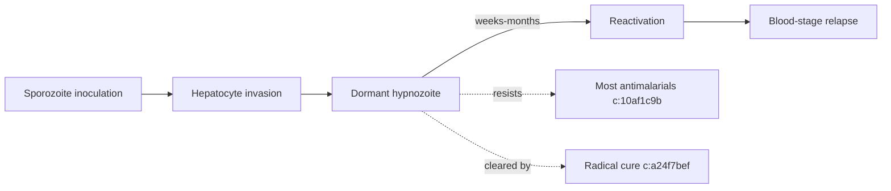

# P. vivax hypnozoites

**Therapeutic category:** Not applicable — target life-stage of [[plasmodium-vivax]], not a drug
**Drug group:** N/A
**Drug class:** N/A
**Controlled substance:** N/A

## Overview

P. vivax hypnozoites = dormant liver-stage parasites of [[plasmodium-vivax]]. Cause relapse weeks-months after primary infection. Targeted by radical cure, not a medication themselves. Entity classified as "medication" in source corpus appears mis-tagged — hypnozoites are the **target**, not the agent. Note assembled per template; most drug-specific fields N/A.

## Indication (Why is this medication prescribed?)

- N/A — hypnozoites are not prescribed. Relevant context: [[radical-cure]] treats hypnozoites in G6PD-normal patients in endemic settings, vs schizonticidal therapy which clears blood stages only [c:a24f7bef] (pending review, expert_opinion).

## Mechanism of Action (How does it work?)

Hypnozoites persist as dormant intrahepatic forms. Resist most antimalarial drugs [c:10af1c9b] (pending review, expert_opinion, high certainty) — explains relapse biology and why blood-stage schizonticides alone fail to cure [[p-vivax-malaria]].

## Dosage and Administration

_No dose claims in current corpus._ Partner hypnozoiticide drugs ([[primaquine]], [[tafenoquine]]) sit in their own notes.

## Contraindications (When not to use it)

_No contraindication claims in current corpus._ Note: radical-cure agents targeting hypnozoites are contraindicated in [[g6pd-deficiency]] — see partner drug notes.

## Warnings and Precautions

- G6PD status load-bearing: radical-cure efficacy/safety claim restricted to **G6PD-normal** population [c:a24f7bef] (pending review). G6PD-deficient patients excluded from this claim scope.

## Side Effects

_Not applicable — hypnozoites are pathogen stage, not a drug._

## Drug Interactions

- Hypnozoites resist most antimalarial drugs [c:10af1c9b] (high certainty, expert_opinion) — pharmacologically: schizonticidal monotherapy insufficient for radical cure. Implication: 8-aminoquinoline partner required.

## Storage and Stability

_Not applicable._

---
*Last regenerated: 2026-05-13T19:16:25Z. Source claims: 2. Evidence mix: 2 expert_opinion (both pending review). Entity-type mismatch flagged: hypnozoite is parasite life-stage, not medication — recommend reclassify to `pathogen` / `life_stage`.*
