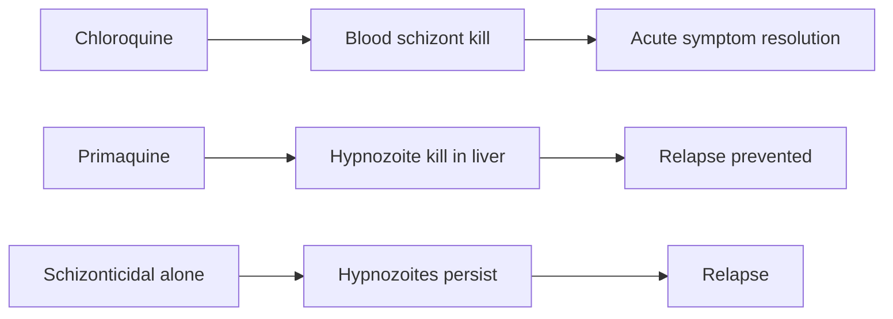

# Primaquine + Chloroquine (radical cure for *P. vivax*)

**Therapeutic category:** Antimalarial — radical cure regimen
**Drug group:** 8-aminoquinoline (primaquine) + 4-aminoquinoline (chloroquine)
**Drug class:** Combination hypnozoiticidal + blood schizonticidal
**Controlled substance:** No

> _Note: entity surfaced as "[[p-vivax-relapse]]"; corpus claims all concern the **primaquine + chloroquine** regimen indicated against that relapse. Note framed around the medication combo._

## Overview

Co-administration of [[primaquine]] (hypnozoiticide) with [[chloroquine]] (blood schizonticide) for radical cure of [[plasmodium-vivax]] malaria. Chloroquine clears blood-stage parasites; primaquine kills dormant liver-stage hypnozoites that drive [[p-vivax-relapse]]. Schizonticidal therapy alone — chloroquine without primaquine — leaves hypnozoites intact and causes relapse [c:1228e637] _(pending review)_.

## Indication (Why is this medication prescribed?)

- Radical cure of [[uncomplicated-vivax-malaria]] to prevent [[p-vivax-relapse]] from [[hypnozoites]] [c:9f16d039] [c:41dffd55] _(both pending review)_.
- Travelers returning to UK with confirmed *P. vivax* — outpatient setting [c:41dffd55] _(pending review)_.

## Mechanism of Action (How does it work?)

Chloroquine kills erythrocytic schizonts → resolves acute parasitemia. Primaquine kills liver hypnozoites → blocks relapse. Schizonticidal-only treatment leaves hypnozoite reservoir intact → relapse [c:1228e637] _(pending review, expert_opinion)_.

Cascade supported by [c:1228e637].

## Dosage and Administration

_No mg/kg, frequency, or duration claims in current corpus._

Supported regimen qualifiers only:
- **Adult, non-pregnant, outpatient, UK traveler:** primaquine + chloroquine **co-administered** (concurrent), not sequential [c:41dffd55] _(pending review, moderate certainty, expert_opinion)_.
- Pediatric, pregnancy, renal-adjusted: _no claims._

## Contraindications (When not to use it)

- Pregnancy — claims restrict use to `not_pregnant` populations [c:9f16d039] [c:41dffd55] _(pending review)_. Treat as relative pending G6PD/pregnancy-specific claims.
- G6PD deficiency, infants: _no corpus claims_ — exclusion not asserted here.

## Warnings and Precautions

- Schizonticidal therapy without primaquine fails to prevent relapse — anti-relapse arm required [c:1228e637] _(pending review)_.
- Sequential (chloroquine then primaquine) dosing inferior to co-administration in cited guideline opinion [c:41dffd55] _(pending review, moderate certainty)_.
- G6PD screening, methemoglobinemia, QT monitoring: _no corpus claims._

## Side Effects

_No side-effect claims in current corpus._ Hemolysis (primaquine in G6PD-deficient), retinopathy/QT (chloroquine) absent from claim set — do not infer.

## Drug Interactions

_No interaction claims in current corpus._

## Storage and Stability

_No storage claims in current corpus._

---
*Last regenerated: 2026-05-13T19:16:46Z. Source claims: 3. Evidence mix: 3 expert_opinion (all pending review). Dominant source: UK malaria treatment guidelines 2016 (PMID:26880088).*
