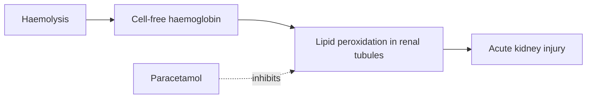

# Paracetamol

**Therapeutic category:** Analgesic / antipyretic
**Drug group:** Aniline analgesic
**Drug class:** Non-opioid analgesic (para-aminophenol derivative)
**Controlled substance:** No

## Overview

Paracetamol is a widely used analgesic and antipyretic. In severe [[plasmodium-knowlesi-malaria]], expert opinion suggests an adjunctive renoprotective role by attenuating haemolysis-driven lipid peroxidation in the kidney [c:26a3eb90] [c:942e062d]. Current corpus limited to two expert-opinion claims; no dose, contraindication, or interaction claims available.

## Indication (Why is this medication prescribed?)

- Adjunctive renoprotection in severe [[plasmodium-knowlesi-malaria]] with [[acute-kidney-injury]] and haemolysis, inpatient setting, Southeast Asia (pending review) [c:26a3eb90]

## Mechanism of Action (How does it work?)

Proposed mechanism in haemolytic severe knowlesi malaria: paracetamol inhibits cell-free haemoglobin–driven lipid peroxidation, reducing oxidative renal tubular injury (pending review) [c:942e062d].

Mechanistic chain supported by [c:942e062d].

## Dosage and Administration

_No dose claims in current corpus._ Regular-frequency dosing referenced qualitatively for inpatient severe knowlesi malaria but mg/kg and duration unspecified [c:26a3eb90] [c:942e062d].

## Contraindications (When not to use it)

_No contraindication claims in current corpus._

## Warnings and Precautions

_No warning/precaution claims in current corpus._

## Side Effects

_No adverse-effect claims in current corpus._

## Drug Interactions

_No interaction claims in current corpus._

## Storage and Stability

_No storage claims in current corpus._

---
*Last regenerated: 2026-05-13T19:17:11.824983+00:00. Source claims: 2. Evidence mix: 2 expert_opinion (both pending review).*
