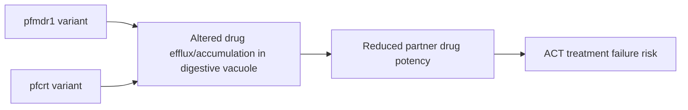

# Partner drug resistance

**Therapeutic category:** _Not a single drug — resistance phenotype affecting ACT partner drugs._
**Drug group:** N/A (resistance concept)
**Drug class:** N/A
**Controlled substance:** N/A

## Overview

"Partner drug resistance" not a medication. Refers to reduced *P. falciparum* susceptibility to non-artemisinin partner in artemisinin-combination therapy (ACT). Driven by parasite transporter mutations. Entry mis-classified as medication; treat as resistance entity. Current corpus only links two transporters as causal drivers.

## Indication (Why is this medication prescribed?)

_Not applicable — partner drug resistance is a parasite phenotype, not a therapeutic agent. No indications in current corpus._

## Mechanism of Action (How does it work?)

Two parasite transporters implicated as causal drivers of partner drug resistance:

- [[p-falciparum-multidrug-resistance-protein-1]] (*pfmdr1*) causes partner drug resistance [c:ddfefdba] *(pending review, expert_opinion)*
- [[p-falciparum-chloroquine-resistance-transporter]] (*pfcrt*) causes partner drug resistance [c:4e8c61fd] *(pending review, expert_opinion)*

Mechanistic cascade beyond transporter → resistance not supported by current claim set [c:ddfefdba][c:4e8c61fd].

## Dosage and Administration

_No dose claims in current corpus._

## Contraindications (When not to use it)

_Not applicable — resistance phenotype, not a drug. No contraindication claims in current corpus._

## Warnings and Precautions

_No warning claims in current corpus._ Clinically, presence of *pfmdr1* or *pfcrt* variants in local parasite population should prompt partner-drug selection review, but no such claim present here.

## Side Effects

_Not applicable — resistance is not administered. No side-effect claims in current corpus._

## Drug Interactions

_No interaction claims in current corpus._ Conceptually, *pfmdr1*/*pfcrt* variants modulate susceptibility to multiple [[act-partner-drugs]] simultaneously, but no specific drug-pair claims present.

## Storage and Stability

_Not applicable._

---
*Last regenerated: 2026-05-13T19:18:02Z. Source claims: 2. Evidence mix: 2 expert_opinion (both pending review). Note: entity mis-typed as medication; reclassification to `resistance_mechanism` recommended.*
