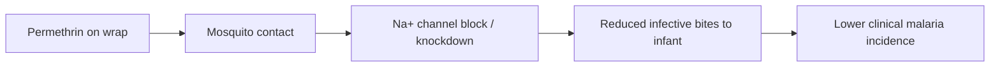

# Permethrin-Treated Baby Wraps

**Therapeutic category:** Antimalarial vector-control device
**Drug group:** Pyrethroid-impregnated textile (passive personal protection)
**Drug class:** Type I pyrethroid insecticide on fabric carrier
**Controlled substance:** No

## Overview

Cloth baby wraps impregnated with permethrin, worn by caregiver carrying infant. Insecticide on fabric repels and kills [[anopheles-mosquitoes]] on contact, reducing bites to infant during high-exposure carrying hours. Tested in [[uganda]] as adjunct to [[long-lasting-insecticidal-net|LLIN]] for infants 6–18 months in endemic setting (pending review).

## Indication (Why is this medication prescribed?)

- Prevention of [[clinical-malaria]] in children 6–18 months in endemic settings, adjunct to pyrethroid-only LLIN [c:193a60dc] (RCT, pending review)

## Mechanism of Action (How does it work?)

[[permethrin]] on wrap fabric contacts host-seeking [[anopheles-mosquitoes]] approaching carried infant. Pyrethroid binds voltage-gated sodium channels in mosquito, causing knockdown and mortality before successful blood meal. Net effect: fewer infective bites reaching infant during carrying hours, lowering clinical malaria incidence vs sham wrap + LLIN alone [c:193a60dc].

[c:193a60dc]

## Dosage and Administration

| Population | Regimen | Route | Frequency | Duration |
|---|---|---|---|---|
| Children 6–18 mo (Uganda, endemic) | Permethrin-treated wrap worn by caregiver | Topical / fabric contact | Re-treat wrap every 4 weeks | 24 weeks studied [c:193a60dc] |

Per-kg permethrin dose not reported in current claim set. _No infant-administered systemic dose — exposure is via fabric contact only._

## Contraindications (When not to use it)

_No contraindication claims in current corpus._

## Warnings and Precautions

- Pending review status — not yet promoted guideline (pending review) [c:193a60dc][c:3864093e]
- Adjunct to LLIN, not replacement — comparator arm retained pyrethroid-only LLIN [c:193a60dc]
- Pyrethroid resistance in local [[anopheles]] populations may attenuate effect (not directly measured in claim set)

## Side Effects

**Common:**
- Rash in wearers (adult women caregivers and children 6–18 mo), 8.5% reporting vs sham [c:3864093e] (RCT, moderate certainty, pending review)

**Serious / rare:** _No claims in current corpus._

## Drug Interactions

_No drug interaction claims in current corpus._ Co-use with pyrethroid-only LLIN demonstrated additive prevention benefit vs LLIN + sham wrap [c:193a60dc] — not an interaction per se but combined vector-control regimen.

## Storage and Stability

Re-treatment cadence every 4 weeks implies field-relevant insecticide decay on fabric over that window [c:193a60dc]. Specific storage/wash-durability claims absent from corpus.

---
*Last regenerated: 2026-05-13T19:18:24.670810+00:00. Source claims: 2. Evidence mix: 2 RCT (both pending review, single trial PMID:40991921).*
