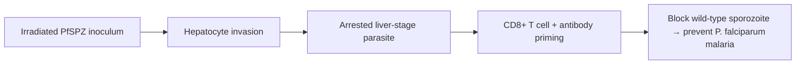

# PfSPZ Vaccine

**Therapeutic category:** Antimalarial vaccine
**Drug group:** Whole-sporozoite malaria vaccine
**Drug class:** Radiation-attenuated *Plasmodium falciparum* sporozoite
**Controlled substance:** No

## Overview

PfSPZ Vaccine is investigational malaria vaccine made from radiation-attenuated, aseptic, purified, cryopreserved *Plasmodium falciparum* sporozoites. Targets pre-erythrocytic stage to prevent [[plasmodium-falciparum-malaria]] infection [c:1e1263ae] (pending review).

## Indication (Why is this medication prescribed?)

- Prevention of [[plasmodium-falciparum-malaria]] [c:1e1263ae] (pending review, moderate certainty)
- Prevention of *P. falciparum* malaria — supportive expert-opinion evidence [c:3ea70610] (pending review, low certainty)

## Mechanism of Action (How does it work?)

Radiation-attenuated sporozoites enter hepatocytes but cannot complete liver-stage development. Arrested parasites prime sterile pre-erythrocytic immunity (CD8+ T cell + antibody response against sporozoite/liver-stage antigens), blocking subsequent wild-type infection before blood stage [c:1e1263ae] (pending review).

Cascade load-bearing claim [c:1e1263ae].

## Dosage and Administration

_No dose claims in current corpus._ Route, schedule, and per-dose sporozoite count not supported by current claim set.

## Contraindications (When not to use it)

_No contraindication claims in current corpus._

## Warnings and Precautions

_No warning or precaution claims in current corpus._ Investigational status — use per trial protocol only.

## Side Effects

_No adverse-event claims in current corpus._

## Drug Interactions

_No interaction claims in current corpus._ Co-administration with [[antimalarial-chemoprophylaxis]] not characterised here.

## Storage and Stability

_No storage claims in current corpus._ Whole-sporozoite product class generally requires cryopreservation; not confirmed by current claims.

---
*Last regenerated: 2026-05-13T19:18:45.733373+00:00. Source claims: 2. Evidence mix: 2 expert_opinion (both pending review).*
