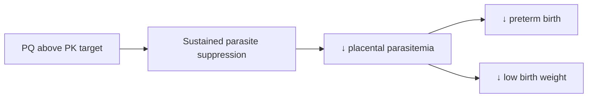

# Piperaquine (exposure above target)

**Therapeutic category:** Antimalarial
**Drug group:** Partner drug, artemisinin combination therapy ([[dihydroartemisinin-piperaquine]])
**Drug class:** Bisquinoline
**Controlled substance:** No

## Overview

Piperaquine long-acting partner drug in [[dihydroartemisinin-piperaquine]] (DP). Note focus pharmacokinetic exposure — time PQ plasma concentration sits above predefined target — during intermittent preventive treatment in pregnancy ([[iptp]]). Higher above-target exposure correlate better pregnancy outcomes in HIV-uninfected women second/third trimester [c:4652f3e5].

## Indication (Why is this medication prescribed?)

- [[intermittent-preventive-treatment-pregnancy]] for [[malaria-in-pregnancy]], HIV-uninfected, 2nd/3rd trimester, endemic outpatient setting [c:4652f3e5] (pending review for LBW/placental endpoints [c:b580ce4a] [c:16a19d0c]).

## Mechanism of Action (How does it work?)

PQ bisquinoline accumulate in parasite digestive vacuole, block heme detoxification → schizonticidal vs [[plasmodium-falciparum]]. Long terminal half-life sustain suppressive concentration between IPTp doses. Sustained exposure above PK target = longer prophylactic window → fewer placental sequestration events → better fetal outcome [c:16a19d0c].

[c:16a19d0c] [c:4652f3e5] [c:b580ce4a]

## Dosage and Administration

_No dose claims in current corpus._ Exposure target derived per-10-day increment above threshold; mg/kg, frequency, duration not specified in claim set [c:4652f3e5].

## Contraindications (When not to use it)

_No contraindication claims in current corpus._

## Warnings and Precautions

- Claim set restrict population HIV-uninfected pregnant women, 2nd/3rd trimester [c:4652f3e5]. Extrapolation HIV-coinfected or 1st trimester not supported here.
- QT-prolongation risk inherent PQ class — not in claim corpus, flag for clinician review.

## Side Effects

_No adverse-event claims in current corpus._

## Drug Interactions

_No interaction claims in current corpus._ ACT partner pairing with [[dihydroartemisinin]] implicit in IPTp regimen but not quantified here.

## Storage and Stability

_No storage claims in current corpus._

## Efficacy summary (exposure–response)

| Outcome | Direction | Comparator | Evidence | Status |
|---|---|---|---|---|
| [[preterm-birth]] | ↓ odds per 10-day above-target PQ | lower PQ exposure | RCT, moderate | auto-promoted [c:4652f3e5] |
| [[low-birth-weight]] | ↓ odds per 10-day above-target PQ | lower PQ exposure | RCT, moderate | pending review [c:b580ce4a] |
| [[placental-parasitemia]] | ↓ odds per 10-day above-target PQ | lower PQ exposure | RCT, moderate | pending review [c:16a19d0c] |

All three endpoints same source (PMID:29547881), same population (HIV-uninfected, 2nd/3rd trimester, endemic outpatient).

---
*Last regenerated: 2026-05-13T19:19:49.957821+00:00. Source claims: 3. Evidence mix: 3 RCT (1 auto-promoted, 2 pending review).*
