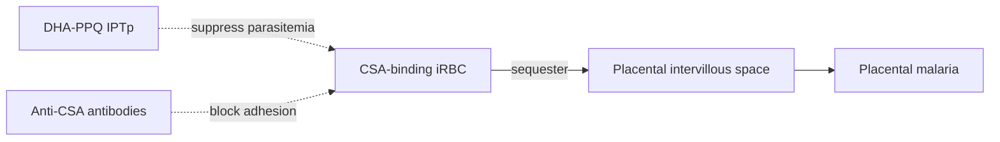

# Dihydroartemisinin-piperaquine

**Therapeutic category:** Antimalarial
**Drug group:** Artemisinin combination therapy (ACT)
**Drug class:** Sesquiterpene endoperoxide + 4-aminoquinoline
**Controlled substance:** No

## Overview

Fixed-dose ACT used for intermittent preventive treatment in pregnancy (IPTp) against [[placental-malaria]]. Corpus positions DHA-PPQ as alternative to [[sulfadoxine-pyrimethamine]] for [[uncomplicated-falciparum-malaria]] prevention in second/third trimester, including [[hiv-coinfection]] settings.

## Indication (Why is this medication prescribed?)

- Prevention of [[placental-malaria]] in pregnant adolescents/adults, second–third trimester, endemic settings [c:51a6e01a] (meta-analysis) [c:4c29a90c] [c:779f1612] (RCT).
- IPTp in HIV-positive pregnant women on [[cotrimoxazole]], sub-Saharan Africa [c:a78dfd13] [c:b23da375] (meta-analysis).

## Mechanism of Action (How does it work?)

_No direct MoA claims in current corpus._ Disease-side mechanism: [[chondroitin-sulfate-a]]-binding parasitized erythrocytes sequester in placenta and cause placental malaria in malaria-naive gravidae [c:657176b7]; semi-immune mothers develop anti-CSA-binding antibodies that prevent sequestration [c:ef16afad] (pending review). DHA-PPQ presumed to act by clearing/suppressing parasitemia before placental sequestration occurs — *not directly supported by claim set.*

Cascade load-bearing: [c:657176b7] [c:ef16afad].

## Dosage and Administration

| Population | Regimen | Comparator | Source |
|---|---|---|---|
| Pregnant, HIV-uninfected, 2nd/3rd trimester (Uganda) | DHA-PPQ, three doses across pregnancy | SP | [c:4c29a90c] RCT |
| Pregnant, HIV-uninfected, 2nd/3rd trimester (Uganda) | DHA-PPQ, monthly through pregnancy | SP | [c:779f1612] RCT |
| Pregnant adults, 2nd/3rd trimester, endemic | DHA-PPQ monthly | SP | [c:51a6e01a] meta-analysis |
| HIV-positive pregnant, sub-Saharan Africa | DHA-PPQ + daily [[cotrimoxazole]] | cotrimoxazole alone | [c:a78dfd13] |

_No mg/kg dose claims in current corpus._ Monthly outperforms three-dose on placental malaria prevalence (27.1% vs 34.1%, histopathology) [c:779f1612] [c:4c29a90c].

## Contraindications (When not to use it)

_No contraindication claims in current corpus._

## Warnings and Precautions

_No warning/precaution claims in current corpus._ QT-prolongation risk (class effect of piperaquine) not represented in this claim set.

## Side Effects

_No adverse-event claims in current corpus._

## Drug Interactions

- Co-administered with daily [[cotrimoxazole]] in HIV-positive pregnant women — additive prevention of placental malaria (RR 0.67, 95% CI 0.50–0.90 histopathology [c:a78dfd13]; RR 0.54, 95% CI 0.31–0.93 blood smear, pooled with [[mefloquine]] arm [c:b23da375]) (pending review).
- Comparator regimen [[sulfadoxine-pyrimethamine]]: DHA-PPQ superior for placental malaria prevention [c:51a6e01a] [c:4c29a90c] [c:779f1612].

## Storage and Stability

_No storage claims in current corpus._

## Adjunct prevention (context)

[[insecticide-treated-nets]] prevent placental malaria at community level, endemic settings [c:23fbd0bb] (pending review) — non-pharmacologic complement to IPTp.

---
*Last regenerated: 2026-05-13T19:20:10Z. Source claims: 8. Evidence mix: 3 meta-analysis · 2 RCT · 3 expert_opinion.*
