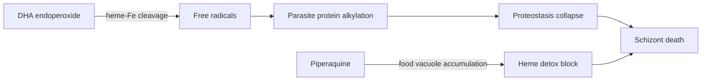

# Dihydroartemisinin-piperaquine

**Therapeutic category:** Antimalarial
**Drug group:** Artemisinin-based combination therapy (ACT)
**Drug class:** Sesquiterpene endoperoxide (dihydroartemisinin) + bisquinoline (piperaquine)
**Controlled substance:** No

> Note: source corpus indexed under entity `[[plasmodium-falciparum-infection]]`. This note surfaces the medication-class claims (DHA-PPQ) in that corpus. Disease-level claims (epidemiology, diagnostics, sequelae) summarised under *Indication* only.

## Overview

Fixed-dose ACT combining short-acting dihydroartemisinin with long-acting piperaquine. Used as intermittent preventive treatment in pregnancy (IPTp) for [[plasmodium-falciparum-infection]] in endemic regions, where it shows antimalarial efficacy versus standard [[sulfadoxine-pyrimethamine]] IPTp [c:d9fa18f9] (pending review).

## Indication (Why is this medication prescribed?)

- Prevention of [[plasmodium-falciparum-infection-in-pregnancy]] (IPTp), 2nd/3rd trimester, HIV-uninfected adults, endemic outpatient setting [c:1bb9d163] (RCT).
- Treatment of [[plasmodium-falciparum-infection-in-pregnancy]] in African endemic settings, pregnant population [c:9212880f] (pending review).
- Indirect rationale: Pf infection causes [[malaria]] [c:2f203d2f], maternal/fetal/infant morbidity-mortality [c:168ee29d], and [[jaundice]] [c:cf76677d] — prevention in pregnancy reduces this burden. Co-infection with [[plasmodium-ovale]], [[plasmodium-malariae]], and bacterial pathogens reported in endemic settings [c:6c7c29a6][c:ddde60c2][c:1f1bb6a8][c:fd03b82e] (all pending review).

## Mechanism of Action (How does it work?)

Dihydroartemisinin = active artemisinin metabolite; endoperoxide bridge cleaved by parasite heme-iron → reactive radicals → parasite protein/lipid alkylation. Piperaquine = long-acting blood schizonticide accumulating in parasite food vacuole, blocking heme detoxification. Parasite [[proteostasis]] perturbation tied to artemisinin action and resistance [c:b9d44edb] (low certainty, pending review).

Proteostasis step [c:b9d44edb].

## Dosage and Administration

| Indication | Population | Regimen | Source |
|---|---|---|---|
| IPTp prevention | Pregnant adult, 2nd/3rd trimester, HIV-uninfected | Every 4 wk **or** every 8 wk, from 12–20 wk gestation through delivery; target piperaquine venous plasma conc **13.9 ng/mL** for 99% protection | [c:1bb9d163] RCT |
| IPTp prevention | Pregnant adult, sub-Saharan Africa | DHA-PPQ IPTp vs SP IPTp comparator; mg/kg not specified in corpus | [c:d9fa18f9] (pending review) |
| Treatment in pregnancy | Pregnant, Africa | DHA-PPQ IPTp; mg/kg not specified in corpus | [c:9212880f] (pending review) |

_No mg/kg dose claims in current corpus — consult WHO ACT guidelines before prescribing._

## Contraindications (When not to use it)

_No contraindication claims in current corpus._

## Warnings and Precautions

_No warning/precaution claims in current corpus._ Standard ACT cautions (QT prolongation with piperaquine, 1st-trimester pregnancy) not supported by current claim set — verify externally.

## Side Effects

_No adverse-event claims in current corpus._

## Drug Interactions

_No interaction claims in current corpus._ Comparator-only mention: [[sulfadoxine-pyrimethamine]] IPTp every 8 wk [c:1bb9d163].

## Storage and Stability

_No storage/stability claims in current corpus._

---
*Last regenerated: 2026-05-13T19:22:32Z. Source claims: 3 of 15 (DHA-PPQ-specific). Evidence mix: 1 RCT · 2 expert_opinion (pending review). Disease-context claims cited inline under Indication.*
