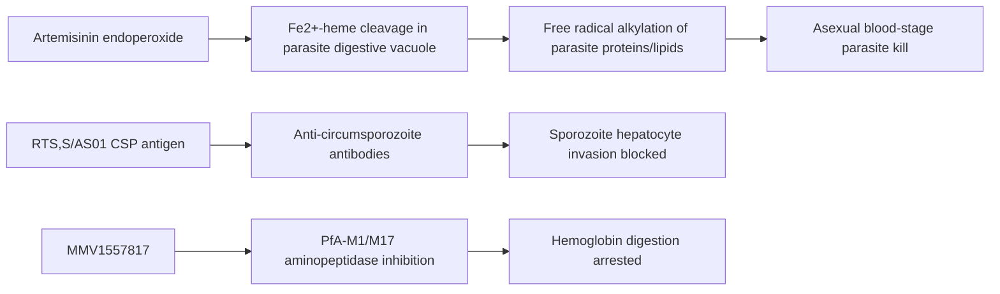

# Plasmodium falciparum malaria — Antimalarial therapeutic class note

**Therapeutic category:** Antimalarial (treatment + chemoprevention + vaccines)
**Drug group:** Mixed — ACTs, 4-aminoquinolines, antifolates, tetracyclines, atovaquone-proguanil, pre-erythrocytic vaccines, sporozoite vaccines, investigational aminopeptidase inhibitors
**Drug class:** Class-level note (entity is disease, not single agent)
**Controlled substance:** No

> Note: Source entity is the disease [[plasmodium-falciparum-malaria]]. Claim set spans multiple agents. Treated here as therapeutic-class summary keyed to that disease, per master-sheet "Medications" column.

## Overview

[[plasmodium-falciparum-malaria]] caused ~600 000 deaths/yr in 2021 across tropical and subtropical regions [c:ad387568][c:e61096eb]. Effective antimalarial treatment exists in endemic [[sub-saharan-africa]] outpatient settings [c:3d7baa62]. Therapy splits into (a) treatment with [[artemisinin]]-based regimens, (b) chemoprevention for travellers, children, and pregnant women, (c) pre-erythrocytic vaccines.

## Indication (Why is this medication prescribed?)

- Acute uncomplicated P. falciparum infection — [[artemisinins]] [c:27565d0d], [[artemisinin-derivatives]] [c:20091eef], [[dihydroartemisinin-piperaquine]] in South East Asia [c:a1a99f4e], historical [[chloroquine]] (now widely resistant) [c:4a7a09a5].
- Intermittent preventive treatment in pregnancy — [[dihydroartemisinin-piperaquine]] monthly, second/third trimester, Uganda [c:7d0210ab].
- Seasonal malaria chemoprevention in children <5 yr, Sahel — [[sulfadoxine-pyrimethamine]] + [[amodiaquine]] [c:9962037e].
- Traveller chemoprophylaxis (non-immune) — [[doxycycline]] [c:6e789e2d], [[atovaquone-proguanil]] [c:433f6ee2].
- Pediatric prevention in endemic regions — [[rts-s-as01]] vaccine ≥5 mo [c:d0e31868][c:1606204e][c:f69236c5][c:86998bea]; [[r21-matrix-m]] in <3 yr [c:910efe0b][c:672b5689]; [[pfspz-vaccine]] and [[pfspz-cvac]] investigational [c:1e1263ae][c:9939ff9f].
- Investigational treatment — [[mmv1557817]] (dual PfA-M1/M17 aminopeptidase inhibitor) [c:1b9f2f02].

## Mechanism of Action (How does it work?)

[[artemisinin]] derivatives are first-line schizonticides for blood-stage parasites [c:27565d0d][c:20091eef]. [[rts-s-as01]] and [[r21-matrix-m]] target pre-erythrocytic circumsporozoite protein [c:d0e31868][c:910efe0b]. [[mmv1557817]] inhibits parasite aminopeptidases PfA-M1/M17 [c:1b9f2f02].

## Dosage and Administration

| Indication | Agent | Population | Regimen |
|---|---|---|---|
| IPTp | dihydroartemisinin-piperaquine | adults, 2nd/3rd trimester | monthly [c:7d0210ab] |
| SMC | SP + amodiaquine | <5 yr, Sahel | monthly × 4 courses per transmission season [c:9962037e] |
| Pediatric prevention | R21/Matrix-M | <3 yr endemic | low-dose schedule [c:910efe0b] |

_No mg/kg dose claims in current corpus for ACTs, chloroquine, doxycycline, atovaquone-proguanil, RTS,S, PfSPZ, or MMV1557817._

## Contraindications (When not to use it)

_No contraindication claims in current corpus._

## Warnings and Precautions

- Artemisinin partial resistance now emerging in [[africa]] — monitor parasite clearance [c:27565d0d] (pending review).
- [[dihydroartemisinin-piperaquine]] efficacy reduced in artemisinin-resistant [[south-east-asia]] regions vs other ACTs (recrudescence/clinical/parasitological failure) [c:a1a99f4e].
- [[chloroquine]] resistance widespread — historical agent only [c:4a7a09a5].

## Side Effects

_No adverse-event claims in current corpus._

## Drug Interactions

- IPTp combination: dihydroartemisinin-piperaquine + [[sulfadoxine-pyrimethamine]] — DHA-PQ monotherapy IRR 0.06 (95% CI 0.03–0.12) vs SP for symptomatic malaria; additive/superior protection [c:7d0210ab] (RCT).
- SMC combination: sulfadoxine-pyrimethamine + amodiaquine — fixed seasonal pairing [c:9962037e].

_No CYP/QT/transporter interaction claims in current corpus._

## Storage and Stability

_No storage claims in current corpus._

---
*Last regenerated: 2026-05-13T19:23:10Z. Source claims: 20. Evidence mix: 1 RCT · 1 meta-analysis · 18 expert_opinion. Note: entity is a disease; treated as antimalarial-class summary. All claims except c:a1a99f4e and c:7d0210ab are pending_review.*
