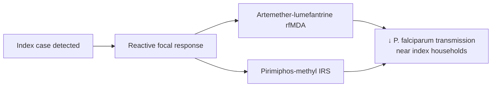

# Artemether-lumefantrine (reactive focal chemoprevention context)

**Therapeutic category:** Antimalarial
**Drug group:** Artemisinin combination therapy (ACT)
**Drug class:** Sesquiterpene endoperoxide + aryl-amino alcohol
**Controlled substance:** No

## Overview

Fixed-dose ACT deployed as reactive focal chemoprevention (rfMDA) around [[plasmodium-falciparum]] index cases in elimination settings. Current claim corpus narrowly scopes [[artemether-lumefantrine]] to transmission-prevention role near index households in [[namibia]] alongside [[pirimiphos-methyl]] indoor residual spraying [c:0ca4eaa0] [c:fdda9571].

## Indication (Why is this medication prescribed?)

- Reactive focal chemoprevention around [[plasmodium-falciparum-index-case]] households to prevent onward transmission, community care level, endemic setting, Namibia (pending review) [c:0ca4eaa0]
- _No claims in corpus for standard uncomplicated or severe falciparum treatment indications._

## Mechanism of Action (How does it work?)

_No mechanism claims in current corpus._ Transmission-prevention effect inferred at population level only; individual-level parasiticidal pathway not represented in claim set [c:0ca4eaa0].

## Dosage and Administration

_No dose claims in current corpus._ Claim `0ca4eaa0` names drug as `artemether-lumefantrine` but `mg_per_kg`, `frequency`, and `duration` fields are null. Do not infer regimen from external knowledge.

| Indication | Population | Dose | Route | Frequency | Duration |
|---|---|---|---|---|---|
| Reactive focal chemoprevention near index case | Community, Namibia | _not specified_ | _not specified_ | _not specified_ | _not specified_ |

## Contraindications (When not to use it)

_No contraindication claims in current corpus._

## Warnings and Precautions

_No warning/precaution claims in current corpus._

## Side Effects

_No adverse-event claims in current corpus._

## Drug Interactions

_No interaction claims in current corpus._ Note: co-deployed but pharmacologically separate from [[pirimiphos-methyl]] IRS in same trial arm [c:fdda9571] — environmental adjunct, not drug-drug interaction.

## Storage and Stability

_No storage claims in current corpus._

## Comparator interventions (transmission outcome)

Outcome `Plasmodium falciparum transmission near index cases` is targeted by two parallel arms in source PMID:38965434:

- [[artemether-lumefantrine]] rfMDA vs. no reactive focal intervention — prevents transmission, low certainty, RCT (pending review) [c:0ca4eaa0]
- [[pirimiphos-methyl]] IRS vs. no reactive focal intervention — prevents transmission, low certainty, RCT (pending review) [c:fdda9571]

Both effects scoped to community level, endemic Namibia, with spillover beyond targeted radius per source title. Effect sizes not in claim qualifiers.

---
*Last regenerated: 2026-05-13T19:24:36Z. Source claims: 2. Evidence mix: 2 RCT (both pending review, low certainty).*
