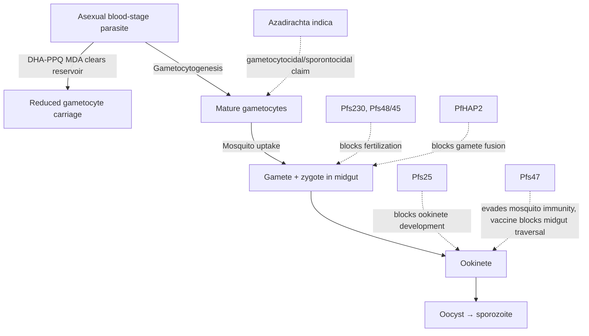

# Plasmodium falciparum transmission-blocking interventions

**Therapeutic category:** Antimalarial — transmission-blocking
**Drug group:** Heterogeneous (ACT mass drug administration, transmission-blocking vaccine antigens, botanical)
**Drug class:** Mixed (artemisinin combination, recombinant gametocyte/ookinete antigens, plant extract)
**Controlled substance:** No

## Overview

Not single drug. Composite entry covering interventions targeting [[plasmodium-falciparum]] transmission stage — gametocyte clearance, mosquito-stage blockade, focal mass drug administration. Includes [[dihydroartemisinin-piperaquine]] focal MDA, transmission-blocking vaccine antigens ([[pfs25]], [[pfs230]], [[pfs48-45]], [[pfs47]], [[pfhap2]]), and botanical [[azadirachta-indica]]. All current claims `expert_opinion` grade, pending review.

## Indication (Why is this medication prescribed?)

- Targeted elimination of [[plasmodium-falciparum]] in Greater Mekong subregion via focal mass treatment with [[dihydroartemisinin-piperaquine]] [c:5d886b6d] (pending review)
- Transmission interruption in endemic settings via vaccine candidates [c:6655178b][c:f60b7589][c:5bf4d11e][c:b793273c][c:ee0b16d4] (pending review)
- Alternative transmission-reduction in endemic settings via [[azadirachta-indica]] [c:d7aa14e4] (pending review, very low certainty)

## Mechanism of Action (How does it work?)

Mechanisms differ per intervention.

Focal MDA with [[dihydroartemisinin-piperaquine]] clears asexual + gametocyte reservoir community-wide [c:5d886b6d]. Pre-fertilization antigens [[pfs230]] [c:f60b7589] + [[pfs48-45]] [c:5bf4d11e] elicit antibodies blocking gamete fertilization. [[pfhap2]] targets gamete membrane fusion [c:ee0b16d4]. Post-fertilization [[pfs25]] blocks ookinete-to-oocyst transition [c:6655178b]. [[pfs47]] disrupts mosquito midgut immune evasion [c:b793273c]. [[azadirachta-indica]] mechanism not specified in corpus [c:d7aa14e4].

## Dosage and Administration

_No dose claims in current corpus._

Focal MDA regimen for [[dihydroartemisinin-piperaquine]] not specified in claim set [c:5d886b6d]. Vaccine antigen doses, schedules, adjuvants absent. Neem preparation undefined [c:d7aa14e4].

## Contraindications (When not to use it)

_No contraindication claims in current corpus._

(For component drug [[dihydroartemisinin-piperaquine]] consult dedicated medication note.)

## Warnings and Precautions

_No warning claims in current corpus._

General caution: focal MDA targets community reservoir — individual benefit-risk differs from therapeutic dosing. Vaccine candidates ([[pfs25]], [[pfs230]], [[pfs48-45]], [[pfs47]], [[pfhap2]]) are research-stage transmission-blocking antigens, not licensed [c:6655178b][c:f60b7589][c:5bf4d11e][c:b793273c][c:ee0b16d4] (pending review). [[azadirachta-indica]] evidence very low — not substitute for licensed [[antimalarials]] [c:d7aa14e4] (pending review).

## Side Effects

_No adverse event claims in current corpus._

## Drug Interactions

_No interaction claims in current corpus._

(Component drug [[dihydroartemisinin-piperaquine]] carries QT-prolongation interaction risk — see dedicated note.)

## Storage and Stability

_No storage claims in current corpus._

---

**Evidence caveat.** Entire claim set graded `expert_opinion`, all `pending_review`. Highest certainty = moderate ([[dihydroartemisinin-piperaquine]] focal MDA in Greater Mekong, community endemic setting) [c:5d886b6d]. Vaccine antigen claims low certainty [c:ee0b16d4][c:6655178b][c:b793273c][c:5bf4d11e][c:f60b7589]. Botanical claim very low [c:d7aa14e4]. No RCT, meta-analysis, or guideline citations present. Entity better modelled as outcome/target than as drug — promote to disease/transmission concept on next review cycle.

---
*Last regenerated: 2026-05-13T19:24:05Z. Source claims: 7. Evidence mix: 7 expert_opinion (all pending review).*
