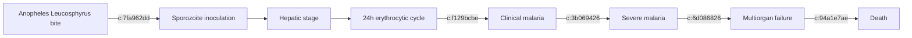

# Plasmodium knowlesi

**Therapeutic category:** _Not applicable — entity is a pathogen, not a medication._
**Drug group:** _N/A_
**Drug class:** _N/A_
**Controlled substance:** _N/A_

> **Classification note:** Entity is the fifth human-infective *Plasmodium* species [c:90a519a0], a simian malaria parasite [c:1087982e] — not a therapeutic agent. Template fields below adapted; pharmacologic sections marked unsupported.

## Overview

Zoonotic apicomplexan parasite causing human malaria across Southeast Asia [c:1b738a81] [c:dd18f73c] [c:1ffa0467] [c:dda6609e], predominantly Malaysia where it ranks as leading cause of human malaria [c:04e2112f] [c:9a4500e3]. Transmitted by *Anopheles* Leucosphyrus Group mosquitoes [c:7fa962dd]. Causes clinical disease spanning uncomplicated to fatal severe malaria [c:f129bcbe] [c:3b069426].

## Indication (Why is this medication prescribed?)

_Not applicable._ Entity is causative pathogen of:

- [[human-malaria]] [c:b9b93eaf] [c:1663c012] [c:1ffa0467] [c:4b60c205] [c:85d4c5cf] [c:dda6609e] [c:9a4500e3]
- [[simian-malaria]] zoonosis in humans [c:b9b9d79b]
- [[severe-malaria]] in adults vs *P. falciparum* comparator [c:335d1eff]
- [[fatal-malaria]], inpatient setting [c:94a1e7ae] [c:3b069426]
- [[multiorgan-failure]] [c:6d086826]

## Mechanism of Action (How does it work?)

_Not a drug — pathogenesis summary._ Sporozoites inoculated by [[anopheles-leucosphyrus-group]] vectors [c:7fa962dd] establish blood-stage infection in humans [c:b9b93eaf]; rapid 24-hour erythrocytic cycle (shortest of human plasmodia) drives clinical disease [c:f129bcbe] and progression to severe/fatal malaria with multiorgan failure [c:6d086826] [c:3b069426].

## Dosage and Administration

_No dose claims in current corpus._ Entity is pathogen; treatment regimens (e.g. [[artemether-lumefantrine]], [[artesunate]]) live on partner drug notes.

## Contraindications (When not to use it)

_Not applicable — pathogen, not therapeutic._

## Warnings and Precautions

Populations at elevated risk / monitoring required:

- Adults ≥45 years — OR 4.7 for death vs <45 y, Sabah Malaysia [c:201b76e2] *(meta-analysis)*
- Female sex — CFR 6.0 per 1000 vs male, adults Sabah [c:58b903a5] *(meta-analysis)*
- Overall CFR 2.5 per 1000 across Southeast Asia [c:3b069426] *(meta-analysis)*
- Infants in endemic Southeast Asia *(pending review, low certainty)* [c:1b738a81]
- Pediatric population, endemic SE Asia *(pending review)* [c:f2db29e9]
- Pregnancy, 2nd/3rd trimester, endemic SE Asia *(pending review, low certainty)* [c:0596fdb9]
- Adults in Malaysia / SE Asia — cases reported since 2004 [c:b08e2425]
- Diagnostic pitfall: microscopic misidentification as [[plasmodium-malariae]] or [[plasmodium-falciparum]]; molecular diagnostics required [c:69176a76]

## Side Effects

_Not applicable — clinical manifestations of infection, not drug ADRs._

- **Serious / mortality risk:** severe malaria [c:335d1eff], multiorgan failure [c:6d086826], fatal outcome [c:94a1e7ae] [c:3b069426]

## Drug Interactions

_No drug-interaction claims in current corpus._

## Storage and Stability

_Not applicable — biological pathogen, not pharmaceutical product._

---
*Last regenerated: 2026-05-13T19:25:42Z. Source claims: 25. Evidence mix: 3 meta_analysis · 22 expert_opinion. All claims pending review.*
