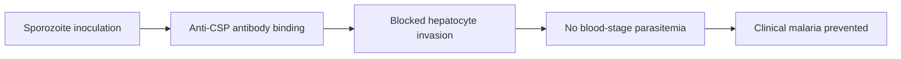

# Plasmodium Malaria (Vaccine Prophylaxis)

**Therapeutic category:** Antimalarial prophylaxis
**Drug group:** Malaria vaccine
**Drug class:** Recombinant protein / multi-antigen subunit vaccine
**Controlled substance:** No

## Overview

Note covers vaccine agents targeting *Plasmodium* malaria prevention in endemic settings. Current corpus references [[rts-s-vaccine]] subunit vaccine plus investigational multi-antigen multi-stage candidates. All claims `pending review`, expert_opinion grade only.

## Indication (Why is this medication prescribed?)

- Prevention of [[plasmodium-malaria]] infection in endemic-setting populations [c:dc33498b] (pending review)
- Investigational use of multi-antigen multi-stage vaccines for broader-stage parasite coverage vs single-stage vaccines [c:0c13ffa9] (pending review)

## Mechanism of Action (How does it work?)

[[rts-s-vaccine]] = recombinant subunit vaccine targeting *P. falciparum* circumsporozoite protein (pre-erythrocytic stage). Induces antibody + T-cell response blocking sporozoite hepatocyte invasion [c:dc33498b] [c:a6845d45] (pending review). Multi-antigen multi-stage candidates target multiple parasite life-cycle stages simultaneously, theoretical edge over single-stage designs [c:0c13ffa9] (pending review).

Cascade supported by [c:dc33498b].

## Dosage and Administration

_No dose claims in current corpus._ Corpus lacks mg/kg, frequency, schedule, route, age-band, pregnancy, renal-adjusted dosing data for [[rts-s-vaccine]] or multi-antigen candidates.

## Contraindications (When not to use it)

_No contraindication claims in current corpus._

## Warnings and Precautions

_No warning or precaution claims in current corpus._

## Side Effects

_No adverse-event claims in current corpus._

## Drug Interactions

_No interaction claims in current corpus._ Co-administration data with [[artemisinin-combination-therapy]], [[seasonal-malaria-chemoprevention]] agents not present.

## Storage and Stability

_No storage or stability claims in current corpus._

---
*Last regenerated: 2026-05-13T19:26:36Z. Source claims: 3. Evidence mix: 3 expert_opinion (all pending review). Single source PMID:36912026. Note: entity labelled "plasmodium malaria" = disease target, not drug — note reframed as vaccine-prophylaxis class summary.*
