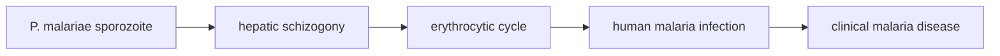

# Plasmodium malariae

**Therapeutic category:** _Not a medication — human malaria parasite (Plasmodium spp.). Entity miscategorised by classifier; note rendered against medication schema for export consistency._
**Drug group:** N/A
**Drug class:** N/A
**Controlled substance:** N/A

## Overview

[[plasmodium-malariae]] is a protozoan parasite causing [[human-malaria]] [c:91506620] [c:f20e4cdb]. Distributed in endemic regions, often co-circulating with [[plasmodium-falciparum]] [c:800e40af] [c:faa1f249] and [[plasmodium-vivax]] [c:c0d51dcc]. Frequently subclinical ("bashful" parasite) [c:eec1071a]. No pharmacologic profile — entity is target organism, not therapeutic agent.

## Indication (Why is this medication prescribed?)

_Not applicable — pathogen, not drug._ Clinical relevance:
- Cause of [[human-malaria-infection]] [c:f20e4cdb] [c:91506620]
- Cause of [[clinical-malaria-disease]] [c:f67b0e2b]
- Asymptomatic community infection, DRC household prevalence 3–4% [c:e3a9a119]
- 1-year cumulative incidence 11% (9–12), Kinshasa community [c:1cfdaab3]
- 1-year incidence 7.8% (6.4–9.1) children + adults, Kinshasa [c:7b924520]
- 2-year cumulative incidence 26% in [[school-age-children]] 5–14y, DRC [c:1f030a47]
- Co-occurs with [[anemia]] in DRC outpatient setting [c:2fd707b3] (pending review, low certainty)

## Mechanism of Action (How does it work?)

_Not applicable — pathogen, not drug._ Corpus describes disease causation only:

Claim chain: parasite → human malaria infection [c:f20e4cdb] → clinical malaria disease [c:f67b0e2b]. Detailed mechanistic steps not in current claim set.

## Dosage and Administration

_No dose claims in current corpus._ Not a therapeutic — no dosing applicable. For treatment of P. malariae infection, see medication notes for chloroquine, ACT regimens (separate entities).

## Contraindications (When not to use it)

_Not applicable — pathogen entity._

## Warnings and Precautions

_Not applicable — pathogen entity._ Epidemiologic flags:
- Frequent co-infection with [[plasmodium-falciparum]] (moderate certainty) [c:800e40af] [c:faa1f249] [c:ddde60c2] — confounds species-attributable morbidity
- Co-circulates with [[plasmodium-vivax]] (low certainty) [c:c0d51dcc]
- Often asymptomatic at community level [c:e3a9a119] — surveillance requires molecular detection

## Side Effects

_Not applicable — pathogen entity._ Associated clinical features in corpus:
- Common: asymptomatic parasitemia [c:e3a9a119]
- Symptomatic: clinical malaria [c:f67b0e2b]
- Co-occurring: [[anemia]], DRC outpatient (low certainty, pending review) [c:2fd707b3]

## Drug Interactions

_Not applicable — pathogen entity. No drug interaction claims in corpus._

## Storage and Stability

_Not applicable — pathogen entity._

---
*Last regenerated: 2026-05-13T19:26:52Z. Source claims: 13. Evidence mix: 13 expert_opinion (all pending review). Entity classifier flagged as medication but is pathogen — recommend reclassify to `organism` / `pathogen` type.*
