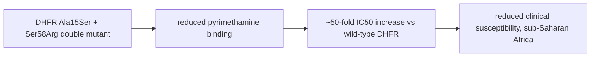

# Plasmodium ovale curtisi

**Therapeutic category:** _Not applicable — entity is human malaria parasite, not medication._
**Drug group:** _Not applicable._
**Drug class:** _Not applicable._
**Controlled substance:** _Not applicable._

## Overview

*Plasmodium ovale curtisi* is one of two sympatric *P. ovale* sibling species causing human malaria [c:daed487c] [c:b264f3cc]. Entity is pathogen, not medication — note retained for graph linkage to [[malaria]], [[pyrimethamine]], and [[dhfr-gene]] resistance claims. Drug-style sections below intentionally empty where claim set offers no dose, mechanism, or safety data.

## Indication (Why is this medication prescribed?)

_Not applicable. Entity is parasite._ Linked clinical conditions caused:
- [[human-malaria-infection]] [c:daed487c] (pending review)
- [[clinical-malaria-disease]] [c:b264f3cc] (pending review)

## Mechanism of Action (How does it work?)

_No mechanism-of-action claims in current corpus._ Resistance mechanism for [[pyrimethamine]] supported:

[c:1d121919] (pending review, expert_opinion grade, E. coli growth assay, sub-Saharan Africa endemic setting)

## Dosage and Administration

_No dose claims in current corpus._

## Contraindications (When not to use it)

_Not applicable. Entity is parasite, not therapeutic agent._

## Warnings and Precautions

_No warning claims in current corpus._ Operational note: [[pyrimethamine]]-containing regimens (e.g. [[sulfadoxine-pyrimethamine]]) likely reduced efficacy vs *P. ovale curtisi* in sub-Saharan Africa per ~50-fold IC50 shift in Ala15Ser-Ser58Arg DHFR mutant [c:1d121919] (pending review).

## Side Effects

_Not applicable._

## Drug Interactions

Resistance / reduced-susceptibility relationship (not pharmacokinetic interaction):
- [[pyrimethamine]] — ↓ susceptibility, ~50× IC50 increase vs wild-type DHFR, mutant Ala15Ser-Ser58Arg, sub-Saharan Africa endemic setting, *in vitro* E. coli growth assay [c:1d121919] (moderate certainty, expert_opinion, pending review).

## Storage and Stability

_Not applicable._

---
*Last regenerated: 2026-05-13T19:27:45Z. Source claims: 3. Evidence mix: 3 expert_opinion (all pending review). Entity-type mismatch: classifier tagged `medication` but subject is parasite species — graph maintainers should reclassify as `pathogen`.*
