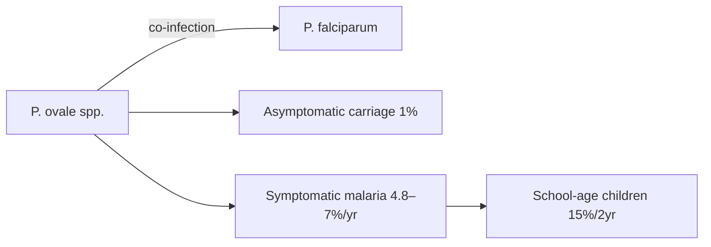

# Plasmodium ovale spp.

**Therapeutic category:** _Not applicable — entity is a malaria parasite, not a medication._
**Drug group:** _Not applicable._
**Drug class:** _Not applicable._
**Controlled substance:** _Not applicable._

## Overview

[[plasmodium-ovale]] spp. is a human malaria parasite, not a therapeutic agent. Classifier flagged it as `medication`; claim set is epidemiological. Co-circulates with [[plasmodium-falciparum]] in [[democratic-republic-of-congo]], causing both asymptomatic and symptomatic infection across age groups [c:4c59fd80] [c:6c7c29a6]. Note below records observed disease burden; no pharmacology applies. Antimalarial management belongs in notes for partner drugs (e.g. [[artemether-lumefantrine]], [[primaquine]]).

## Indication (Why is this medication prescribed?)

_Not applicable — pathogen, not therapy._ Disease attribution from current corpus:

- Causes [[malaria-infection]] in community settings, Kinshasa, DRC — 1-year incidence 4.8% (CI 3.7–5.9) in children and adults [c:447cd037] (pending review).
- Causes malaria infection broadly in DRC — 1-year cumulative incidence 7% (CI 5–8) [c:4c59fd80] (pending review).
- Causes [[asymptomatic-malaria-infection]] at household survey in DRC — prevalence 1% (CI 1–2) [c:6fb55f81] (pending review).
- Causes malaria infection in [[school-age-children]] (5–14 y), DRC — 2-year cumulative incidence 15% [c:b540f86a] (pending review).

## Mechanism of Action (How does it work?)

_Not applicable — no mechanism-of-action claims for a therapeutic agent._ Epidemiological co-occurrence only:

- Co-occurs with [[plasmodium-falciparum]] in DRC community settings [c:b8bb34f8] (pending review).
- Co-occurs with P. falciparum infection in Kinshasa school-age children [c:6c7c29a6] (pending review).

## Dosage and Administration

_No dose claims in current corpus._ Entity is not a drug.

## Contraindications (When not to use it)

_Not applicable — pathogen, not medication._

## Warnings and Precautions

_Not applicable to entity itself._ Clinical relevance signal from corpus:

- High co-infection burden with P. falciparum in DRC — single-species treatment regimens may miss ovale [c:b8bb34f8] [c:6c7c29a6] (pending review).
- Asymptomatic reservoir documented at household level — passive case detection underestimates true burden [c:6fb55f81] (pending review).
- School-age children carry disproportionate incidence (15%/2 yr vs 4.8–7%/1 yr population-wide) — surveillance and treatment targeting indicated [c:b540f86a] [c:447cd037] (pending review).

## Side Effects

_Not applicable — pathogen produces disease, not adverse drug effects._ Spectrum from claims: asymptomatic carriage through symptomatic malaria infection [c:6fb55f81] [c:4c59fd80]. No mortality data in current corpus.

## Drug Interactions

_Not applicable — pathogen, not pharmacologic agent._

## Storage and Stability

_Not applicable._

---

**Entity-type warning:** classifier hint `medication` mismatches subject. Recommend reclassifying to `pathogen` / `organism` template. All efficacy, dose, interaction, and contraindication sections are structurally inapplicable. Evidence base is uniformly `expert_opinion` grade, all `pending_review`, all from two DRC cohort/cross-sectional sources (PMID:37790376, PMID:37857597). Do not promote claims without independent corroboration outside Kinshasa.

*Last regenerated: 2026-05-13T19:28:08Z. Source claims: 6. Evidence mix: 6 expert_opinion (all pending review).*
