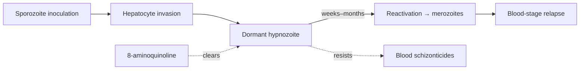

# Plasmodium vivax hypnozoite

**Therapeutic category:** Not applicable — parasite life stage, not a medication
**Drug group:** N/A (dormant liver-stage form of [[plasmodium-vivax]])
**Drug class:** N/A
**Controlled substance:** N/A

> _Entity classifier flagged this as `medication`, but the subject is a parasite life stage. Note written as target profile with anti-hypnozoite therapy summarised from current claim corpus._

## Overview

Dormant intrahepatic form of [[plasmodium-vivax]]. Persists in hepatocytes after primary infection and reactivates weeks–months later, driving [[relapsing-malaria]] [c:3bb0703e]. Refractory to most schizonticidal antimalarials [c:c1317ee2]; clearance ("radical cure") requires 8-aminoquinoline therapy.

## Indication (Why is this medication prescribed?)

Not a medication. Clinical relevance:
- Target of radical cure regimens in [[plasmodium-vivax-malaria]] [c:5e57acd7]
- Reservoir driving [[relapsing-malaria]] in endemic settings [c:3bb0703e]

## Mechanism of Action (How does it work?)

Hypnozoite biology — not pharmacology. Anti-hypnozoite agents ([[tafenoquine]], [[primaquine]]) act via 8-aminoquinoline-mediated oxidative damage on liver-stage parasites; hypnozoite itself evades blood-schizonticides [c:c1317ee2].

Cascade supported by [c:c1317ee2] [c:3bb0703e].

## Dosage and Administration

_No dose claims for the hypnozoite itself — not a drug._

Anti-hypnozoite regimen referenced in corpus:

| Population | Agent | Regimen | Comparator | Source |
|---|---|---|---|---|
| Adults, normal G6PD, not pregnant, outpatient | [[tafenoquine]] | Single dose | [[primaquine]] 14 days | [c:5e57acd7] (expert_opinion, pending review) |

Dose magnitude (mg/kg) not specified in current claim set.

## Contraindications (When not to use it)

Applies to anti-hypnozoite therapy, not the parasite stage:
- G6PD deficiency — claim only supports tafenoquine in patients with normal G6PD activity [c:5e57acd7]
- Pregnancy — claim restricts tafenoquine use to non-pregnant adults [c:5e57acd7]

## Warnings and Precautions

- G6PD testing required before 8-aminoquinoline radical cure [c:5e57acd7]
- Hypnozoite reservoir not cleared by standard ACT or chloroquine — schizonticide-only treatment predicts relapse [c:c1317ee2] [c:3bb0703e]
- Pediatric, pregnant, lactating populations: no claims in current corpus _(pending review)_

## Side Effects

_No drug side-effect claims for hypnozoite (parasite stage). Tafenoquine/primaquine adverse-effect profiles not in current claim set._

## Drug Interactions

_No interaction claims in current corpus._

## Storage and Stability

Not applicable — biological dormant form, intrahepatic. Persistence: weeks to months in vivo, drives delayed relapse [c:3bb0703e].

---
*Last regenerated: 2026-05-13T19:30:14Z. Source claims: 3. Evidence mix: 3 expert_opinion (all pending review).*
