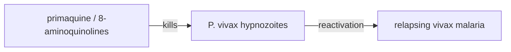

# Plasmodium vivax hypnozoites

**Therapeutic category:** _Not applicable — entity is a parasite dormant liver-stage, not a medication. Classifier mismatch flagged._
**Drug group:** _N/A_
**Drug class:** _N/A_
**Controlled substance:** _N/A_

## Overview

Hypnozoites are dormant liver-stage forms of [[plasmodium-vivax]] that cause relapsing vivax malaria in endemic settings [c:97bc41e7] (pending review). They are a **drug target**, not a drug. Current claim corpus describes agents acting against them: [[primaquine]] [c:e7a14608] and the broader [[8-aminoquinolines]] class [c:e637b70b].

## Indication (Why is this medication prescribed?)

_Not applicable — hypnozoites are pathogen, not therapy._ Relevant downstream indication treated by anti-hypnozoite drugs:
- [[relapsing-vivax-malaria]] — radical cure [c:97bc41e7] [c:e7a14608] (pending review).

## Mechanism of Action (How does it work?)

_Not applicable._ Mechanism of action belongs to the killing agents, not the target. Claim set supports drug→target relationship only:

[c:e7a14608] [c:e637b70b] [c:97bc41e7] (all pending review; evidence_grade: expert_opinion).

## Dosage and Administration

_No dose claims in current corpus._ Primaquine and tafenoquine dosing for radical cure exist in literature but no dose-qualified claim is present here. Do not infer.

## Contraindications (When not to use it)

_No contraindication claims in current corpus._ Note: 8-aminoquinoline use clinically requires [[g6pd-deficiency]] screening — claim absent here, not surfaced.

## Warnings and Precautions

_No warning claims in current corpus._

## Side Effects

_No adverse-event claims in current corpus._

## Drug Interactions

_No interaction claims in current corpus._

## Storage and Stability

_Not applicable — entity is biological life stage, not pharmaceutical product._

---

**Classification note:** Entity `plasmodium vivax hypnozoites` was tagged `medication` by upstream classifier. It is a **parasite dormant liver-stage / drug target**. Recommend reclassify as `pathogen-life-stage` or `drug-target`. Drug notes for [[primaquine]] and [[tafenoquine]] should carry the radical-cure treatment claims.

*Last regenerated: 2026-05-13T19:30:39Z. Source claims: 3. Evidence mix: 3 expert_opinion (all pending review).*
