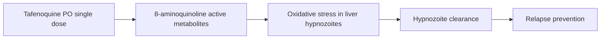

# Tafenoquine

**Therapeutic category:** Antimalarial
**Drug group:** Hypnozoiticidal radical-cure agent
**Drug class:** 8-aminoquinoline
**Controlled substance:** No

> Note: source entity tagged `plasmodium vivax malaria`. Corpus covers multiple anti-vivax agents (primaquine, chloroquine, ACT, MMV1557817). Note centered on tafenoquine — strongest evidence (meta-analysis, auto-promoted). Comparator drugs surfaced inline.

## Overview

Tafenoquine is a single-dose 8-aminoquinoline used for radical cure of [[plasmodium-vivax-malaria]] — clearing dormant liver hypnozoites to prevent relapse. Single-dose convenience contrasts with 14-day [[primaquine]] regimens [c:8953e2cc]. G6PD testing required pre-administration due to hemolysis risk in deficient patients [c:f6b43b47].

## Indication (Why is this medication prescribed?)

- Radical cure of [[plasmodium-vivax-malaria]] in endemic settings (e.g. Korea) [c:254041fc] *(pending review)*
- Radical cure following [[chloroquine]] blood-stage treatment in [[brazilian-amazon]] outpatients ≥6 months, non-pregnant, G6PD-tested [c:f6b43b47] *(pending review)*
- Modeled 12.27% additional decadal case prevention vs primaquine in Korea [c:254041fc] *(pending review)*

## Mechanism of Action (How does it work?)

8-aminoquinoline. Hypnozoiticidal — kills [[hypnozoites]] in hepatocytes. Individual patient data meta-analysis shows 300 mg (5 mg/kg) single dose reaches ~70% of maximal hypnozoiticidal effect in adults [c:7c2f7abe] (evidence_grade: meta_analysis).

Cascade load-bearing claim [c:7c2f7abe].

## Dosage and Administration

| Population | Dose | Route | Frequency | Duration | Citation |
|---|---|---|---|---|---|
| Adults, P. vivax radical cure | 300 mg (5 mg/kg) | PO | Single dose | One-time | [c:7c2f7abe] |
| ≥6 months, non-pregnant, G6PD-normal, Brazilian Amazon | Single-dose tafenoquine + [[chloroquine]] blood-stage | PO | Single dose | One-time | [c:f6b43b47] |

Pediatric <6 months, pregnancy, renal-adjusted: _No dose claims in current corpus._

## Contraindications (When not to use it)

- G6PD-deficient patients — quantitative G6PD testing prerequisite [c:f6b43b47]
- Pregnancy — excluded from operational cohort [c:f6b43b47]
- Age <6 months — outside studied population [c:f6b43b47]

## Warnings and Precautions

- Mandatory point-of-care quantitative G6PD testing before dosing; 99.7% (95% CI 99.4–99.8) appropriate treatment when protocol followed [c:f6b43b47]
- Hemolysis risk inferred from G6PD-testing requirement [c:f6b43b47]

Black-box / monitoring details beyond G6PD: _No claims in current corpus._

## Side Effects

_No side-effect claims in current corpus._ Hemolytic anemia risk inferable from class + G6PD precaution [c:f6b43b47] but not directly claimed.

## Drug Interactions

_No interaction claims in current corpus._ Co-administration with [[chloroquine]] for blood-stage clearance is standard regimen pairing, not flagged as interaction [c:f6b43b47].

## Storage and Stability

_No storage claims in current corpus._

## Comparator agents in corpus

- [[primaquine]] — 14-day regimen, lower drug cost (~USD 3.71 cycle, Korea) [c:8953e2cc] *(pending review)*
- [[chloroquine]] — blood-stage partner; first-line in non-endemic [[netherlands]] outpatient P. vivax [c:16488a65] *(pending review)*
- [[artemisinin-combination-therapy]] — endemic-setting alternative [c:c6d26b5b] *(pending review)*
- [[mmv1557817]] — investigational dual aminopeptidase inhibitor, cross-species activity [c:9650b7cd] *(pending review)*

---
*Last regenerated: 2026-05-13T19:31:18Z. Source claims: 7 (4 tafenoquine-relevant). Evidence mix: 1 meta_analysis · 1 cohort · 5 expert_opinion.*
