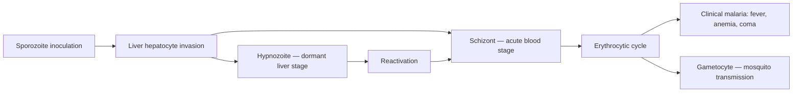

# Plasmodium vivax

**Therapeutic category:** _Not applicable — entity is a protozoan parasite, not a medication._
**Drug group:** _Not applicable_
**Drug class:** _Not applicable_
**Controlled substance:** _Not applicable_

> **Classifier note:** Entity received as `medication` but Plasmodium vivax is a [[plasmodium-genus]] parasite causing [[vivax-malaria]]. Note rendered against medication schema; pharmacologic sections marked non-applicable. Re-classify upstream as `pathogen` / `organism`.

## Overview

Plasmodium vivax is a human malaria parasite, second leading global cause of malaria and dominant species outside Africa [c:c7f61af5][c:eda535c4]. Caused ~12.4 M clinical cases in 2022 (CI 10.7–14.8 M) [c:9ce5aeea] and ~2.8% of global malaria cases in 2019 [c:931b8553], with ~2.5 B people at risk [c:5ccb9556]. Distinct from [[plasmodium-falciparum]] via dormant liver-stage hypnozoites driving relapse [c:84748987][c:611d742a].

## Indication (Why is this medication prescribed?)

_Not applicable — pathogen, not therapeutic agent._ Conditions caused:
- [[uncomplicated-vivax-malaria]] — clinical malaria with fever, anemia, coma [c:0a98f134][c:88250477][c:52321cce]
- [[relapsing-malaria]] from latent [[hypnozoite]] liver reservoir [c:16a6b063][c:611d742a][c:05a2e5c3]
- Malaria in pregnancy — relapsing infection [c:b4d5164b][c:f8a8585a][c:beba7004] (pending review)
- Severe/fatal vivax illness [c:a58fe9f7] (pending review)
- Endemic malaria in [[india]] (Arunachal Pradesh, Mizoram, Nagaland, Jharkhand, Odisha, Chhattisgarh, Goa, Daman & Diu, Dadra & Nagar Haveli, Andaman & Nicobar) [c:8b56aa67][c:d428a14f][c:536ab898]
- Major morbidity driver globally [c:4431c9a9][c:86bb8b28] (~8% global malaria share)

## Mechanism of Action (How does it work?)

_Not pharmacologic._ Pathogenesis cascade:

Lifecycle stages: gametocyte [c:8ea029a7], dormant liver-stage hypnozoite [c:84748987]. Hypnozoite reservoir → relapse [c:611d742a] and superinfection (multiple concurrent blood-stage clones) [c:e8023336]. Same-clone recurrent parasitemia documented at 23.9% in twice-sampled [[guyana]] patients [c:47a16126]. Polyclonality ~2.1× P. falciparum in sympatric setting [c:d2e1aa34]. Local relapse without recent endemic travel — 11% of P. vivax patients in Greater Georgetown [c:05a2e5c3].

## Dosage and Administration

_No dose claims in current corpus._ Entity is pathogen — see treatment notes for [[chloroquine]], [[primaquine]], [[tafenoquine]], [[artemisinin-combination-therapy]].

## Contraindications (When not to use it)

_Not applicable — pathogen, not therapeutic agent._

## Warnings and Precautions

_Not applicable to pathogen._ Clinical-relevance flags:
- **Chloroquine resistance** in endemic regions with common resistance — empiric chloroquine monotherapy unreliable [c:2838d6b7][c:aa6e0356]
- **Relapse risk** mandates radical cure (hypnozoiticidal) — blood-stage clearance alone insufficient [c:611d742a][c:16a6b063]
- **Pregnancy** — relapsing infection complicates antimalarial selection [c:b4d5164b][c:f8a8585a] (pending review)
- **Severe disease possible** despite historical "benign tertian" framing [c:a58fe9f7] (pending review)
- **Co-infection** with [[plasmodium-ovale]] [c:e780c90c] and [[plasmodium-malariae]] [c:c0d51dcc] reported (low certainty)
- **Adult skew** in [[guyana]] endemic data vs P. falciparum [c:67fc8010]

## Side Effects

_Not applicable to pathogen._ Disease manifestations: fever, anemia, coma [c:88250477]; severe/fatal illness [c:a58fe9f7].

## Drug Interactions

_Not applicable — pathogen entity has no pharmacokinetic interactions._ Resistance pattern: chloroquine resistance in endemic regions [c:2838d6b7][c:aa6e0356].

## Storage and Stability

_Not applicable to pathogen._

---
*Last regenerated: 2026-05-13T19:29:38Z. Source claims: 31. Evidence mix: 31 expert_opinion (all `pending_review`). **Schema mismatch flag:** entity is pathogen, not medication — re-route to pathogen template upstream.*
