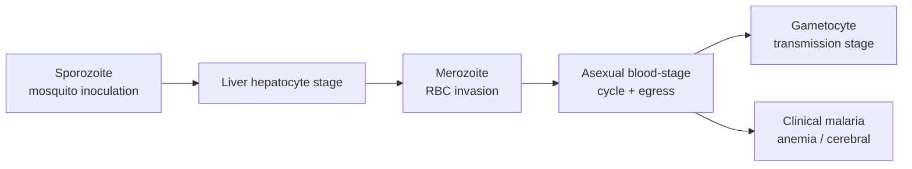

# Plasmodium

**Therapeutic category:** Not applicable — Plasmodium is a pathogen, not a medication
**Drug group:** N/A (entity misclassified as medication; classifies as protozoan intracellular parasite [c:e94c6ad7])
**Drug class:** N/A
**Controlled substance:** N/A

## Overview

Plasmodium = protozoan intracellular parasite causing human malaria [c:e94c6ad7][c:ce7540a2][c:c42ef453]. Affects red blood cells [c:472ff9fc]. ~240 million annual cases globally [c:c9ad9ecd], ~500,000 annual deaths worldwide [c:a131b5d2], 438,000 deaths/yr in endemic areas [c:1a33d1bf], 429,000 deaths/yr in children <5 (2015) [c:44076d58]. Entity belongs in pathogen sheet, not Medications. _Note: classifier hint flagged this as `medication` — likely mislabeled. Treat downstream as organism record._

## Indication (Why is this medication prescribed?)

_Not applicable — Plasmodium is target organism, not therapeutic agent._ Disease states caused (pending review):

- [[malaria]] (general) [c:ce7540a2][c:c42ef453]
- [[cerebral-malaria]] [c:a7ec1ecb] (pending review)
- [[severe-anemia]] in malaria [c:78597a79] (pending review)
- Imported [[malaria]] in non-endemic settings — e.g. Netherlands, ~250 cases/yr (200–300), immune-naive travelers [c:2bdb5b2c] (pending review)
- Pediatric malaria mortality, <5y endemic [c:44076d58] (pending review)

## Mechanism of Action (How does it work?)

Plasmodium is the disease-causing agent, not a drug. Lifecycle stages relevant to drug targeting: sporozoite [c:06586eb0], merozoite [c:216e82ba], gametocyte [c:22b09015]. Parasite requires host cell egress for life cycle completion [c:b5cf2484]. Invades [[red-blood-cells]] during blood stage [c:472ff9fc].

Egress across stages = pan-lifecycle drug target [c:b5cf2484][c:06586eb0][c:216e82ba][c:22b09015].

## Dosage and Administration

_No dose claims in current corpus._ Plasmodium is not a drug — dosing inapplicable. For antimalarial dosing, see notes on [[artemether-lumefantrine]], [[dihydroartemisinin-piperaquine]], [[sulfadoxine-pyrimethamine]], [[amodiaquine]].

## Contraindications (When not to use it)

_Not applicable — entity is pathogen._

## Warnings and Precautions

Resistance landscape (load-bearing for antimalarial selection):

- Resists established antimalarial drugs, endemic settings [c:4121fdef][c:6255ee09][c:cd0576f0] (pending review)
- Resists existing antimalarial interventions in [[africa]] [c:c0b49dfc] (pending review)
- Resists antimalarial chemoprevention drugs, endemic settings [c:9c5dd854] (pending review)
- Resists [[sulfadoxine-pyrimethamine]] + [[amodiaquine]] in Africa **outside [[sahel]]** [c:4febd4c2] (pending review) — population qualifier load-bearing for SMC policy
- Resists [[sulphadoxine-pyrimethamine]] in pregnant adults (2nd/3rd trimester), outpatient endemic — **meta-analysis, auto-promoted** [c:1117cba7]

Monitoring: surveillance for [[kelch13-mutations]] and partner-drug resistance markers advised in endemic programs (no direct claim in corpus; downstream inference).

## Side Effects

_Not applicable — entity is pathogen._ Disease manifestations (mortality risk flagged):

- **Mortality risk:** cerebral malaria [c:a7ec1ecb], severe anemia [c:78597a79], pediatric <5 mortality [c:44076d58][c:1a33d1bf], global mortality ~500k/yr [c:a131b5d2]
- Common: febrile blood-stage illness via RBC infection [c:472ff9fc]

## Drug Interactions

_Not applicable in pharmacological sense._ Parasite–drug "interactions" = resistance, covered under Warnings.

## Storage and Stability

_Not applicable._ Plasmodium = live obligate intracellular parasite [c:e94c6ad7]; not a stored therapeutic.

---
*Last regenerated: 2026-05-13T19:21:04Z. Source claims: 22. Evidence mix: 1 meta_analysis (auto-promoted) · 21 expert_opinion (pending review). Schema mismatch flag: entity is pathogen, not medication — recommend reclassification to `organism`/`pathogen` sheet.*
